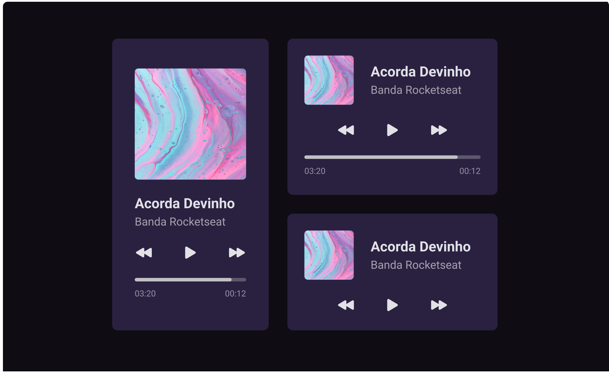

<h1 align="center"> MusicBOOM 💣 </h1>

Esse projeto foi desenvolvido no projeto bora codar #1 da Rocketseat. 

  <a href="#-tecnologias">Tecnologias</a>&nbsp;&nbsp;&nbsp;|&nbsp;&nbsp;&nbsp;
  <a href="#-projeto">Projeto</a>&nbsp;&nbsp;&nbsp;|&nbsp;&nbsp;&nbsp;
  <a href="#-layout">Layout</a>&nbsp;&nbsp;&nbsp;|&nbsp;&nbsp;&nbsp;
  <a href="#memo-licença">Licença</a>

  

 

## 🚀 Tecnologias

Esse projeto foi desenvolvido com as seguintes tecnologias:

- HTML e CSS
- Git e Github
- Figma

## 💻 Projeto

O MusicBOOM é um projeto de interface moderna e intuitiva para player de música, projetado para oferecer uma experiência imersiva tanto em desktop quanto em dispositivos móveis. 

## 🔖 Layout

Você pode visualizar o layout do projeto através [DESSE LINK](https://www.figma.com/design/nynSEPE4kOXWcQgG7jOF98/Player-de-M%C3%BAsica-%E2%80%A2-Desafio-01-(Community)?m=auto&t=TFhEciAuCXdJmcYM-6). É necessário ter conta no [Figma](https://figma.com) para acessá-lo.

## 🌌 Ver Site 
Confira aqui: https://luisfelipets17.github.io/MusicBOOM/

## :memo: Licença

Esse projeto está sob a licença MIT.

---

